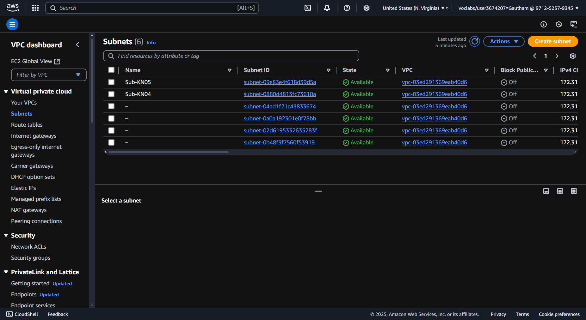

Ein VPC (Virtual Private Cloud) ist wie eine Wolke, die privat ist und einem allein gehört und nicht der ganzen Welt, aber diese Wolke ist keine Wolke, sondern ein Server in einem Serverkluster irgendwo auf der Welt.

Ein Subnet ist ein Bereich im Netz, wo man auf alles im Netz zugreifen kann, wenn man im Subnetz ist.

Ich habe bisher keine Subnetzte definiert, da das automatisch geschah.

Eine öffentliche IP ist von überall zugreifbar, solange man Internet hat, meine ich. Auf eine private IP kann man nur von innerhalb des eigenen Subnetzes zugreifen.

Eine statische IP hat man, wenn sich die eigene IP-Adresse nicht verändert, auch wenn man das Gerät aus- und wieder einstellt.

Ich werde wahrscheinlich als IPs 172.31.0.10 und 172.31.0.20 verwenden, da ich als IPv4 CIDR 172.31.0.0/20 habe.